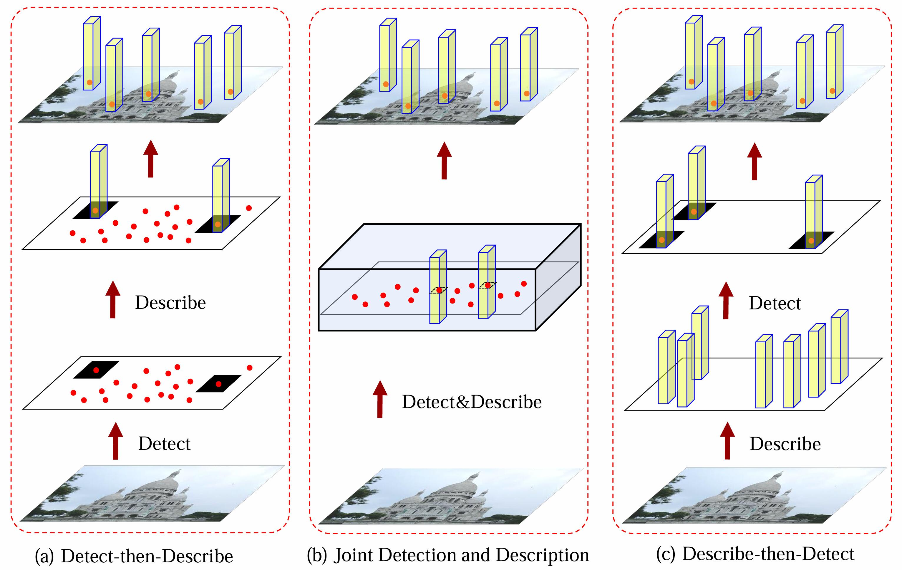
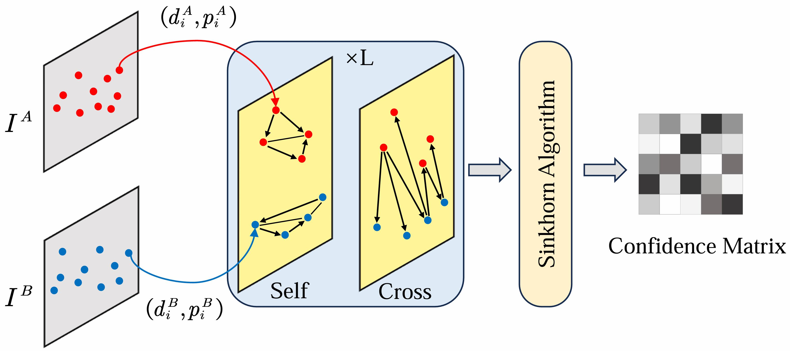

<h1 align="center">Awesome Local Feature Matching</h1>


<p align="center"><strong>✨ Information Fusion 2024 ✨</strong></p>


<p align="center">
  <a href="https://arxiv.org/abs/2401.17592"></a>
  <a href="https://www.sciencedirect.com/science/article/pii/S1566253524001222"></a>
  <a href="https://mp.weixin.qq.com/s/_dAJ8e_DLDAnKnvtWxt9sA"></a>
  <a href="https://github.com/vignywang/Awesome-Local-Feature-Matching/stargazers"></a>
  <a href="https://opensource.org/license/mit"></a>
</p>

<p align="center">
  <strong><a href="https://scholar.google.com/citations?user=htmrWvUAAAAJ&amp;hl=zh-CN&amp;oi=ao">Shibiao Xu<sup>1</sup></a></strong> &nbsp;·&nbsp;
  <strong><a href="https://scholar.google.com/citations?user=azDgUMUAAAAJ&amp;hl=zh-CN&amp;oi=ao">Shunpeng Chen<sup>1</sup></a></strong> &nbsp;·&nbsp;
  <strong><a href="https://scholar.google.com/citations?user=_IUq7ooAAAAJ&amp;hl=zh-CN&amp;oi=ao">Rongtao Xu<sup>2</sup></a></strong> &nbsp;·&nbsp;
  <strong><a href="https://scholar.google.com/citations?user=DnJKQI8AAAAJ&amp;hl=zh-CN&amp;oi=ao">Changwei Wang<sup>2</sup></a></strong> &nbsp;·&nbsp;
  <strong><a href="https://openreview.net/profile?id=~Peng_Lu8">Peng Lu<sup>1</sup></a></strong> &nbsp;·&nbsp;
  <strong><a href="https://openreview.net/profile?id=~Li_Guo5">Li Guo<sup>1</sup></a></strong>
</p>

<p align="center">
  <sup>1</sup> School of Artificial Intelligence, BUPT, China<br>
  <sup>2</sup> State Key Laboratory of Multimodal Artificial Intelligence Systems, CASIA, China
</p>

- This is the official companion repository for the survey [Local feature matching using deep learning: A survey](https://www.sciencedirect.com/science/article/pii/S1566253524001222).
- It organizes deep learning-based local feature matching methods using the survey's detector-based and detector-free taxonomy. Also tracks representative work published or accepted during 2024–2026.

> Spotted a missing paper, incorrect metadata, or a broken link? Please open an [Issue](https://github.com/vignywang/Awesome-Local-Feature-Matching/issues) or submit a [pull request](https://github.com/vignywang/Awesome-Local-Feature-Matching/pulls).


<a id="news"></a>
## 🎉 News

- **2026/09/05:** 🚀 Added representative local feature matching papers from 2024–2026.
- **2024/03/03:** 🎊 Our survey was officially accepted by Information Fusion!

## Table of Contents

- [News](#news) · [Recent Advances](#recent-advances-2024present) · [2026](#2026) · [2025](#2025) · [2024](#2024)
- [Survey Taxonomy](#survey-taxonomy) · [Detector-based Models](#detector-based-models) · [Detector-free Models](#detector-free-models)
- [Detect-then-Describe](#detect-then-describe) · [Joint Detection and Description](#joint-detection-and-description) · [Describe-then-Detect](#describe-then-detect) · [Graph Based](#graph-based)
- [CNN Based](#cnn-based) · [Transformer Based](#transformer-based) · [Patch Based](#patch-based)
- [Benchmarks and Evaluation](#benchmarks-and-evaluation) · [Applications](#applications)
- [Structure from Motion](#structure-from-motion) · [Remote Sensing Image Registration](#remote-sensing-image-registration) · [Medical Image Registration](#medical-image-registration)
- [Related Surveys](#related-surveys) · [Citation](#citation) · [Acknowledgement](#acknowledgement) · [License](#license)

<a id="recent-advances-2024present"></a>
## 🔥 Recent Advances (2024–Present)

### 2026

- **SLiM** `(CVPR 2026)` &ensp;Scalable Feature Matching via State Space Modeling and Sparse Correlation [[paper]](https://openaccess.thecvf.com/content/CVPR2026/papers/Choo_Scalable_Feature_Matching_via_State_Space_Modeling_and_Sparse_Correlation_CVPR_2026_paper.pdf) <a href="https://github.com/Band-127/SLiM"></a>
- **LoMa** `(ECCV 2026)` &ensp;Local Feature Matching Revisited [[paper]](https://arxiv.org/abs/2604.04931) [[venue record]](https://eccv.ecva.net/Conferences/2026/AcceptedPapers) <a href="https://github.com/davnords/LoMa"></a>
- **RoMa v2** `(ECCV 2026)` &ensp;Harder Better Faster Denser Feature Matching [[paper]](https://arxiv.org/abs/2511.15706) [[venue record]](https://eccv.ecva.net/Conferences/2026/AcceptedPapers) <a href="https://github.com/Parskatt/RoMaV2"></a>
- **TextFM** `(CVPR 2026)` &ensp;Robust Semi-dense Feature Matching with Language Guidance [[paper]](https://openaccess.thecvf.com/content/CVPR2026/html/Zheng_TextFM_Robust_Semi-dense_Feature_Matching_with_Language_Guidance_CVPR_2026_paper.html)
- **MESA** `(TPAMI 2026)` &ensp;Effective Matching Redundancy Reduction by Semantic Area Segmentation [[paper]](https://doi.org/10.1109/TPAMI.2025.3644296) [[arXiv]](https://arxiv.org/abs/2408.00279) <a href="https://github.com/Easonyesheng/A2PM-MESA"></a>
- **SigMa** `(TIP 2026)` &ensp;Semantic Similarity-Guided Semi-Dense Feature Matching [[paper]](https://doi.org/10.1109/TIP.2026.3654367)
- **Free-Form Local Feature Matching** `(TPAMI 2026)` &ensp;Toward Free-Form Local Feature Matching [[paper]](https://doi.org/10.1109/TPAMI.2025.3614652)

### 2025

- **EDM** `(ICCV 2025)` &ensp;Efficient Deep Feature Matching [[paper]](https://openaccess.thecvf.com/content/ICCV2025/html/Li_EDM_Efficient_Deep_Feature_Matching_ICCV_2025_paper.html) [[arXiv]](https://arxiv.org/abs/2503.05122) <a href="https://github.com/chicleee/EDM"></a>
- **JamMa** `(CVPR 2025)` &ensp;Ultra-lightweight Local Feature Matching with Joint Mamba [[paper]](https://openaccess.thecvf.com/content/CVPR2025/html/Lu_JamMa_Ultra-lightweight_Local_Feature_Matching_with_Joint_Mamba_CVPR_2025_paper.html) [[arXiv]](https://arxiv.org/abs/2503.03437) <a href="https://github.com/leoluxxx/JamMa"></a>
- **L2M** `(ICCV 2025)` &ensp;Learning Dense Feature Matching via Lifting Single 2D Image to 3D Space [[paper]](https://openaccess.thecvf.com/content/ICCV2025/html/Liang_Learning_Dense_Feature_Matching_via_Lifting_Single_2D_Image_to_ICCV_2025_paper.html) [[arXiv]](https://arxiv.org/abs/2507.00392) <a href="https://github.com/Sharpiless/L2M"></a>
- **MATCHA** `(CVPR 2025)` &ensp;Towards Matching Anything [[paper]](https://openaccess.thecvf.com/content/CVPR2025/html/Xue_MATCHA_Towards_Matching_Anything_CVPR_2025_paper.html) [[arXiv]](https://arxiv.org/abs/2501.14945) <a href="https://github.com/feixue94/matcha"></a>
- **CasP** `(ICCV 2025)` &ensp;Improving Semi-Dense Feature Matching Pipeline Leveraging Cascaded Correspondence Priors for Guidance [[paper]](https://openaccess.thecvf.com/content/ICCV2025/html/Chen_CasP_Improving_Semi-Dense_Feature_Matching_Pipeline_Leveraging_Cascaded_Correspondence_Priors_ICCV_2025_paper.html) [[arXiv]](https://arxiv.org/abs/2507.17312) <a href="https://github.com/pq-chen/CasP"></a>
- **MINIMA** `(CVPR 2025)` &ensp;Modality Invariant Image Matching [[paper]](https://openaccess.thecvf.com/content/CVPR2025/html/Ren_MINIMA_Modality_Invariant_Image_Matching_CVPR_2025_paper.html) [[arXiv]](https://arxiv.org/abs/2412.19412) <a href="https://github.com/LSXI7/MINIMA"></a>
- **MIFNet** `(TIP 2025)` &ensp;Learning Modality-Invariant Features for Generalizable Multimodal Image Matching [[paper]](https://doi.org/10.1109/TIP.2025.3574937) [[arXiv]](https://arxiv.org/abs/2501.11299)
- **SAMFeat** `(TIP 2025)` &ensp;Segment Anything Model Is a Good Teacher for Local Feature Learning [[paper]](https://doi.org/10.1109/TIP.2025.3554033) [[arXiv]](https://arxiv.org/abs/2309.16992) <a href="https://github.com/vignywang/SAMFeat"></a>
- **MambaGlue** `(ICRA 2025)` &ensp;Fast and Robust Local Feature Matching with Mamba [[paper]](https://doi.org/10.1109/ICRA55743.2025.11128473) [[arXiv]](https://arxiv.org/abs/2502.00462) <a href="https://github.com/url-kaist/MambaGlue"></a>
- **LiftFeat** `(ICRA 2025)` &ensp;3D Geometry-Aware Local Feature Matching [[paper]](https://doi.org/10.1109/ICRA55743.2025.11127853) [[arXiv]](https://arxiv.org/abs/2505.03422) <a href="https://github.com/lyp-deeplearning/LiftFeat"></a>
- **DaD** `(arXiv 2025)` &ensp;Distilled Reinforcement Learning for Diverse Keypoint Detection [[paper]](https://arxiv.org/abs/2503.07347) <a href="https://github.com/Parskatt/dad"></a>
- **MatchAnything** `(arXiv 2025)` &ensp;Universal Cross-Modality Image Matching with Large-Scale Pre-Training [[paper]](https://arxiv.org/abs/2501.07556) <a href="https://github.com/zju3dv/MatchAnything"></a>

### 2024

- **Efficient LoFTR** `(CVPR 2024)` &ensp;Semi-Dense Local Feature Matching with Sparse-Like Speed [[paper]](https://openaccess.thecvf.com/content/CVPR2024/html/Wang_Efficient_LoFTR_Semi-Dense_Local_Feature_Matching_with_Sparse-Like_Speed_CVPR_2024_paper.html) [[arXiv]](https://arxiv.org/abs/2403.04765) <a href="https://github.com/zju3dv/EfficientLoFTR"></a>
- **XFeat** `(CVPR 2024)` &ensp;Accelerated Features for Lightweight Image Matching [[paper]](https://openaccess.thecvf.com/content/CVPR2024/html/Potje_XFeat_Accelerated_Features_for_Lightweight_Image_Matching_CVPR_2024_paper.html) [[arXiv]](https://arxiv.org/abs/2404.19174) <a href="https://github.com/verlab/accelerated_features"></a>
- **MASt3R** `(ECCV 2024)` &ensp;Grounding Image Matching in 3D with MASt3R [[paper]](https://www.ecva.net/papers/eccv_2024/papers_ECCV/papers/09080.pdf) [[arXiv]](https://arxiv.org/abs/2406.09756) <a href="https://github.com/naver/mast3r"></a>
- **GIM** `(ICLR 2024)` &ensp;Learning Generalizable Image Matcher from Internet Videos [[paper]](https://openreview.net/forum?id=NYN1b8GRGS) [[arXiv]](https://arxiv.org/abs/2402.11095) <a href="https://github.com/xuelunshen/gim"></a>
- **OmniGlue** `(CVPR 2024)` &ensp;Generalizable Feature Matching with Foundation Model Guidance [[paper]](https://openaccess.thecvf.com/content/CVPR2024/html/Jiang_OmniGlue_Generalizable_Feature_Matching_with_Foundation_Model_Guidance_CVPR_2024_paper.html) [[arXiv]](https://arxiv.org/abs/2405.12979) <a href="https://github.com/google-research/omniglue"></a>
- **DeDoDe** `(3DV 2024)` &ensp;Detect, Don't Describe—Describe, Don't Detect for Local Feature Matching [[paper]](https://doi.org/10.1109/3DV62453.2024.00035) [[arXiv]](https://arxiv.org/abs/2308.08479) <a href="https://github.com/Parskatt/DeDoDe"></a>
- **RCM** `(ECCV 2024)` &ensp;Raising the Ceiling: Conflict-Free Local Feature Matching with Dynamic View Switching [[paper]](https://www.ecva.net/papers/eccv_2024/papers_ECCV/papers/05862.pdf) [[arXiv]](https://arxiv.org/abs/2407.07789) <a href="https://github.com/leoluxxx/RCM"></a>
- **EcoMatcher** `(ECCV 2024)` &ensp;Efficient Clustering Oriented Matcher for Detector-free Image Matching [[paper]](https://www.ecva.net/papers/eccv_2024/papers_ECCV/papers/08613.pdf)
- **iMatching** `(ECCV 2024)` &ensp;Imperative Correspondence Learning [[paper]](https://www.ecva.net/papers/eccv_2024/papers_ECCV/papers/05586.pdf) [[arXiv]](https://arxiv.org/abs/2312.02141) <a href="https://github.com/sair-lab/iMatching"></a>
- **DHM-Net** `(TIP 2024)` &ensp;Deep Hypergraph Modeling for Robust Feature Matching [[paper]](https://doi.org/10.1109/TIP.2024.3477916)
- **GRiD** `(TIP 2024)` &ensp;Guided Refinement for Detector-Free Multimodal Image Matching [[paper]](https://doi.org/10.1109/TIP.2024.3472491)
- **XoFTR** `(CVPRW 2024)` &ensp;Cross-modal Feature Matching Transformer [[paper]](https://openaccess.thecvf.com/content/CVPR2024W/IMW/html/Tuzcuoglu_XoFTR_Cross-modal_Feature_Matching_Transformer_CVPRW_2024_paper.html) [[arXiv]](https://arxiv.org/abs/2404.09692) <a href="https://github.com/OnderT/XoFTR"></a>
- **DeDoDe v2** `(CVPRW 2024)` &ensp;Analyzing and Improving the DeDoDe Keypoint Detector [[paper]](https://openaccess.thecvf.com/content/CVPR2024W/IMW/html/Edstedt_DeDoDe_v2_Analyzing_and_Improving_the_DeDoDe_Keypoint_Detector_CVPRW_2024_paper.html) <a href="https://github.com/Parskatt/DeDoDe"></a>

<a id="survey-taxonomy"></a>
## 📚 Survey Taxonomy

The survey organizes deep local feature matching into two model families and seven subcategories. Entries are ordered from newer to older work, with venue metadata updated to the formal publication when available.

### Detector-based Models

<p align="center">
  
</p>
<p align="center">
  Fig. 1. Detector-based pipelines: (a) Detect-then-Describe, (b) Joint Detection and Description, and (c) Describe-then-Detect.
</p>

#### Detect-then-Describe

- **AWDesc** `(TPAMI 2023)` &ensp;Attention Weighted Local Descriptors [[paper]](https://doi.org/10.1109/TPAMI.2023.3266728) <a href="https://github.com/vignywang/AWDesc"></a>
- **S-TREK** `(ICCV 2023)` &ensp;Sequential Translation and Rotation Equivariant Keypoints for Local Feature Extraction [[paper]](https://openaccess.thecvf.com/content/ICCV2023/html/Santellani_S-TREK_Sequential_Translation_and_Rotation_Equivariant_Keypoints_for_Local_Feature_ICCV_2023_paper.html)
- **ZippyPoint** `(CVPRW 2023)` &ensp;Fast Interest Point Detection, Description, and Matching Through Mixed Precision Discretization [[paper]](https://openaccess.thecvf.com/content/CVPR2023W/IMW/papers/Kanakis_ZippyPoint_Fast_Interest_Point_Detection_Description_and_Matching_Through_Mixed_CVPRW_2023_paper.pdf) <a href="https://github.com/menelaoskanakis/ZippyPoint"></a>
- **CNDesc** `(TMM 2023)` &ensp;Cross Normalization for Local Descriptors Learning [[paper]](https://doi.org/10.1109/TMM.2022.3169331) <a href="https://github.com/vignywang/CNDesc"></a>
- **ALIKE** `(TMM 2023)` &ensp;Accurate and Lightweight Keypoint Detection and Descriptor Extraction [[paper]](https://doi.org/10.1109/TMM.2022.3155927) [[arXiv]](https://arxiv.org/abs/2112.02906) <a href="https://github.com/Shiaoming/ALIKE"></a>
- **MTLDesc** `(AAAI 2022)` &ensp;Looking Wider to Describe Better [[paper]](https://ojs.aaai.org/index.php/AAAI/article/view/20138) <a href="https://github.com/vignywang/MTLDesc"></a>
- **KP2D** `(ICLR 2020)` &ensp;Neural Outlier Rejection for Self-Supervised Keypoint Learning [[paper]](https://openreview.net/forum?id=XhrpFrneoIe) [[arXiv]](https://arxiv.org/abs/1912.10615) <a href="https://github.com/TRI-ML/KP2D"></a>
- **HyNet** `(NeurIPS 2020)` &ensp;Learning Local Descriptor with Hybrid Similarity Measure and Triplet Loss [[paper]](https://proceedings.neurips.cc/paper/2020/file/52d2752b150f9c35ccb6869cbf074e48-Paper.pdf) <a href="https://github.com/yuruntian/HyNet"></a>
- **Key.Net** `(ICCV 2019)` &ensp;Keypoint Detection by Handcrafted and Learned CNN Filters [[paper]](https://openaccess.thecvf.com/content_ICCV_2019/html/Barroso-Laguna_Key.Net_Keypoint_Detection_by_Handcrafted_and_Learned_CNN_Filters_ICCV_2019_paper.html) <a href="https://github.com/axelBarroso/Key.Net"></a>
- **Log-Polar Descriptors** `(ICCV 2019)` &ensp;Beyond Cartesian Representations for Local Descriptors [[paper]](https://openaccess.thecvf.com/content_ICCV_2019/html/Ebel_Beyond_Cartesian_Representations_for_Local_Descriptors_ICCV_2019_paper.html) <a href="https://github.com/cvlab-epfl/log-polar-descriptors"></a>
- **SOSNet** `(CVPR 2019)` &ensp;Second Order Similarity Regularization for Local Descriptor Learning [[paper]](https://openaccess.thecvf.com/content_CVPR_2019/html/Tian_SOSNet_Second_Order_Similarity_Regularization_for_Local_Descriptor_Learning_CVPR_2019_paper.html) <a href="https://github.com/yuruntian/SOSNet"></a>
- **ContextDesc** `(CVPR 2019)` &ensp;Local Descriptor Augmentation with Cross-Modality Context [[paper]](https://openaccess.thecvf.com/content_CVPR_2019/html/Luo_ContextDesc_Local_Descriptor_Augmentation_With_Cross-Modality_Context_CVPR_2019_paper.html) <a href="https://github.com/lzx551402/contextdesc"></a>
- **GeoDesc** `(ECCV 2018)` &ensp;Learning Local Descriptors by Integrating Geometry Constraints [[paper]](https://openaccess.thecvf.com/content_ECCV_2018/html/Zixin_Luo_Learning_Local_Descriptors_ECCV_2018_paper.html) <a href="https://github.com/lzx551402/geodesc"></a>
- **HardNet** `(NeurIPS 2017)` &ensp;Working Hard to Know Your Neighbor's Margins: Local Descriptor Learning Loss [[paper]](https://proceedings.neurips.cc/paper_files/paper/2017/file/831caa1b600f852b7844499430ecac17-Paper.pdf) <a href="https://github.com/DagnyT/hardnet"></a>
- **L2-Net** `(CVPR 2017)` &ensp;Deep Learning of Discriminative Patch Descriptor in Euclidean Space [[paper]](https://openaccess.thecvf.com/content_cvpr_2017/html/Tian_L2-Net_Deep_Learning_CVPR_2017_paper.html) <a href="https://github.com/yuruntian/L2-Net"></a>
- **OriNet** `(CVPR 2016)` &ensp;Learning to Assign Orientations to Feature Points [[paper]](https://openaccess.thecvf.com/content_cvpr_2016/html/Yi_Learning_to_Assign_CVPR_2016_paper.html)

#### Joint Detection and Description

- **FeatureBooster** `(CVPR 2023)` &ensp;Boosting Feature Descriptors with a Lightweight Neural Network [[paper]](https://openaccess.thecvf.com/content/CVPR2023/html/Wang_FeatureBooster_Boosting_Feature_Descriptors_With_a_Lightweight_Neural_Network_CVPR_2023_paper.html) <a href="https://github.com/SJTU-ViSYS/FeatureBooster"></a>
- **SFD2** `(CVPR 2023)` &ensp;Semantic-Guided Feature Detection and Description [[paper]](https://openaccess.thecvf.com/content/CVPR2023/html/Xue_SFD2_Semantic-Guided_Feature_Detection_and_Description_CVPR_2023_paper.html) <a href="https://github.com/feixue94/sfd2"></a>
- **RELF** `(CVPR 2023)` &ensp;Learning Rotation-Equivariant Features for Visual Correspondence [[paper]](https://openaccess.thecvf.com/content/CVPR2023/html/Lee_Learning_Rotation-Equivariant_Features_for_Visual_Correspondence_CVPR_2023_paper.html) <a href="https://github.com/bluedream1121/RELF"></a>
- **SeLF** `(TIP 2022)` &ensp;Learning Semantic-Aware Local Features for Long Term Visual Localization [[paper]](https://ieeexplore.ieee.org/document/9829199)
- **LLF** `(WACV 2021)` &ensp;Learning of Low-Level Feature Keypoints for Accurate and Robust Detection [[paper]](https://openaccess.thecvf.com/content/WACV2021/html/Suwanwimolkul_Learning_of_Low-Level_Feature_Keypoints_for_Accurate_and_Robust_Detection_WACV_2021_paper.html)
- **RoRD** `(IROS 2021)` &ensp;Rotation-Robust Descriptors and Orthographic Views for Local Feature Matching [[paper]](https://doi.org/10.1109/IROS51168.2021.9636619) [[arXiv]](https://arxiv.org/abs/2103.08573) <a href="https://github.com/UditSinghParihar/RoRD"></a>
- **ASLFeat** `(CVPR 2020)` &ensp;Learning Local Features of Accurate Shape and Localization [[paper]](https://openaccess.thecvf.com/content_CVPR_2020/html/Luo_ASLFeat_Learning_Local_Features_of_Accurate_Shape_and_Localization_CVPR_2020_paper.html) <a href="https://github.com/lzx551402/ASLFeat"></a>
- **MLIFeat** `(ACCV 2020)` &ensp;Multi-level Information Fusion Based Deep Local Features [[paper]](https://openaccess.thecvf.com/content/ACCV2020/html/Zhang_MLIFeat_Multi-level_information_fusion_based_deep_local_features_ACCV_2020_paper.html)
- **HDD-Net** `(ACCV 2020)` &ensp;Hybrid Detector Descriptor with Mutual Interactive Learning [[paper]](https://openaccess.thecvf.com/content/ACCV2020/papers/Barroso-Laguna_HDD-Net_Hybrid_Detector_Descriptor_with_Mutual_Interactive_Learning_ACCV_2020_paper.pdf) <a href="https://github.com/axelBarroso/HDD-Net"></a>
- **Reinforced Feature Points** `(CVPR 2020)` &ensp;Optimizing Feature Detection and Description for a High-Level Task [[paper]](https://openaccess.thecvf.com/content_CVPR_2020/html/Bhowmik_Reinforced_Feature_Points_Optimizing_Feature_Detection_and_Description_for_a_CVPR_2020_paper.html) <a href="https://github.com/aritrabhowmik/Reinforced-Feature-Points"></a>
- **DISK** `(NeurIPS 2020)` &ensp;Learning Local Features with Policy Gradient [[paper]](https://proceedings.neurips.cc/paper/2020/hash/a42a596fc71e17828440030074d15e74-Abstract.html) [[arXiv]](https://arxiv.org/abs/2006.13566) <a href="https://github.com/cvlab-epfl/disk"></a>
- **RF-Net** `(CVPR 2019)` &ensp;An End-to-End Image Matching Network Based on Receptive Field [[paper]](https://openaccess.thecvf.com/content_CVPR_2019/html/Shen_RF-Net_An_End-To-End_Image_Matching_Network_Based_on_Receptive_Field_CVPR_2019_paper.html) <a href="https://github.com/xuelunshen/rfnet"></a>
- **D2-Net** `(CVPR 2019)` &ensp;A Trainable CNN for Joint Description and Detection of Local Features [[paper]](https://openaccess.thecvf.com/content_CVPR_2019/html/Dusmanu_D2-Net_A_Trainable_CNN_for_Joint_Description_and_Detection_of_CVPR_2019_paper.html) <a href="https://github.com/mihaidusmanu/d2-net"></a>
- **R2D2** `(NeurIPS 2019)` &ensp;Reliable and Repeatable Detector and Descriptor [[paper]](https://proceedings.neurips.cc/paper/2019/hash/3198dfd0aef271d22f7bcddd6f12f5cb-Abstract.html) [[arXiv]](https://arxiv.org/abs/1906.06195) <a href="https://github.com/naver/r2d2"></a>
- **LF-Net** `(NeurIPS 2018)` &ensp;Learning Local Features from Images [[paper]](https://proceedings.neurips.cc/paper/2018/file/f5496252609c43eb8a3d147ab9b9c006-Paper.pdf) <a href="https://github.com/vcg-uvic/lf-net-release"></a>
- **SuperPoint** `(CVPRW 2018)` &ensp;Self-Supervised Interest Point Detection and Description [[paper]](https://openaccess.thecvf.com/content_cvpr_2018_workshops/w9/html/DeTone_SuperPoint_Self-Supervised_Interest_CVPR_2018_paper.html) <a href="https://github.com/magicleap/SuperPointPretrainedNetwork"></a>

#### Describe-then-Detect

- **ReDFeat** `(TIP 2023)` &ensp;Recoupling Detection and Description for Multimodal Feature Learning [[paper]](https://doi.org/10.1109/TIP.2022.3231135) [[arXiv]](https://arxiv.org/abs/2205.07439) <a href="https://github.com/ACuOoOoO/ReDFeat"></a>
- **PoSFeat** `(CVPR 2022)` &ensp;Decoupling Makes Weakly Supervised Local Feature Better [[paper]](https://openaccess.thecvf.com/content/CVPR2022/html/Li_Decoupling_Makes_Weakly_Supervised_Local_Feature_Better_CVPR_2022_paper.html) <a href="https://github.com/SYSU-SAIL/PoSFeat"></a>
- **SCFeat** `(arXiv 2022)` &ensp;Shared Coupling-Bridge for Weakly Supervised Local Feature Learning [[paper]](https://arxiv.org/abs/2212.07047) <a href="https://github.com/sunjiayuanro/SCFeat"></a>
- **D2D** `(ACCV 2020)` &ensp;Keypoint Extraction with Describe to Detect Approach [[paper]](https://openaccess.thecvf.com/content/ACCV2020/papers/Tian_D2D_Keypoint_Extraction_with_Describe_to_Detect_Approach_ACCV_2020_paper.pdf)

#### Graph Based

<p align="center">
  
</p>
<p align="center">
  Fig. 2. A general GNN matching pipeline: encode keypoint geometry and appearance, alternate self- and cross-attention, and estimate a partial assignment.
</p>

- **MaKeGNN** `(TIP 2025)` &ensp;Learning Feature Matching via Matchable Keypoint-Assisted Graph Neural Network [[paper]](https://doi.org/10.1109/TIP.2024.3512352) [[arXiv]](https://arxiv.org/abs/2307.01447)
- **ResMatch** `(AAAI 2024)` &ensp;Residual Attention Learning for Feature Matching [[paper]](https://ojs.aaai.org/index.php/AAAI/article/view/27915) [[arXiv]](https://arxiv.org/abs/2307.05180) <a href="https://github.com/ACuOoOoO/ResMatch"></a>
- **GlueStick** `(ICCV 2023)` &ensp;Robust Image Matching by Sticking Points and Lines Together [[paper]](https://openaccess.thecvf.com/content/ICCV2023/html/Pautrat_GlueStick_Robust_Image_Matching_by_Sticking_Points_and_Lines_Together_ICCV_2023_paper.html) <a href="https://github.com/cvg/GlueStick"></a>
- **LightGlue** `(ICCV 2023)` &ensp;Local Feature Matching at Light Speed [[paper]](https://openaccess.thecvf.com/content/ICCV2023/html/Lindenberger_LightGlue_Local_Feature_Matching_at_Light_Speed_ICCV_2023_paper.html) [[arXiv]](https://arxiv.org/abs/2306.13643) <a href="https://github.com/cvg/LightGlue"></a>
- **ParaFormer** `(AAAI 2023)` &ensp;Parallel Attention Transformer for Efficient Feature Matching [[paper]](https://ojs.aaai.org/index.php/AAAI/article/view/25275) [[arXiv]](https://arxiv.org/abs/2303.00941)
- **HTMatch** `(Signal Processing 2023)` &ensp;An Efficient Hybrid Transformer Based Graph Neural Network for Local Feature Matching [[paper]](https://www.sciencedirect.com/science/article/pii/S016516842200398X)
- **ClusterGNN** `(CVPR 2022)` &ensp;Cluster-Based Coarse-To-Fine Graph Neural Network for Efficient Feature Matching [[paper]](https://openaccess.thecvf.com/content/CVPR2022/html/Shi_ClusterGNN_Cluster-Based_Coarse-To-Fine_Graph_Neural_Network_for_Efficient_Feature_Matching_CVPR_2022_paper.html)
- **DenseGAP** `(ICPR 2022)` &ensp;Graph-Structured Dense Correspondence Learning with Anchor Points [[paper]](https://doi.org/10.1109/ICPR56361.2022.9956472) [[arXiv]](https://arxiv.org/abs/2112.06910)
- **SGMNet** `(ICCV 2021)` &ensp;Learning to Match Features with Seeded Graph Matching Network [[paper]](https://openaccess.thecvf.com/content/ICCV2021/html/Chen_Learning_To_Match_Features_With_Seeded_Graph_Matching_Network_ICCV_2021_paper.html) <a href="https://github.com/vdvchen/SGMNet"></a>
- **SuperGlue** `(CVPR 2020)` &ensp;Learning Feature Matching with Graph Neural Networks [[paper]](https://openaccess.thecvf.com/content_CVPR_2020/html/Sarlin_SuperGlue_Learning_Feature_Matching_With_Graph_Neural_Networks_CVPR_2020_paper.html) <a href="https://github.com/magicleap/SuperGluePretrainedNetwork"></a>

### Detector-free Models

Detector-free methods establish correspondences directly from dense or regularly sampled image features, rather than relying on an independently selected set of repeatable keypoints.

#### CNN Based

- **PDC-Net+** `(TPAMI 2023)` &ensp;Enhanced Probabilistic Dense Correspondence Network [[paper]](https://doi.org/10.1109/TPAMI.2023.3249225) [[arXiv]](https://arxiv.org/abs/2109.13912) <a href="https://github.com/PruneTruong/DenseMatching"></a>
- **PUMP** `(CVPR 2022)` &ensp;Pyramidal and Uniqueness Matching Priors for Unsupervised Learning of Local Descriptors [[paper]](https://openaccess.thecvf.com/content/CVPR2022/html/Revaud_PUMP_Pyramidal_and_Uniqueness_Matching_Priors_for_Unsupervised_Learning_of_CVPR_2022_paper.html) <a href="https://github.com/naver/pump"></a>
- **PDC-Net** `(CVPR 2021)` &ensp;Learning Accurate Dense Correspondences and When to Trust Them [[paper]](https://openaccess.thecvf.com/content/CVPR2021/html/Truong_Learning_Accurate_Dense_Correspondences_and_When_To_Trust_Them_CVPR_2021_paper.html) <a href="https://github.com/PruneTruong/DenseMatching"></a>
- **DFM** `(CVPRW 2021)` &ensp;A Performance Baseline for Deep Feature Matching [[paper]](https://openaccess.thecvf.com/content/CVPR2021W/IMW/html/Efe_DFM_A_Performance_Baseline_for_Deep_Feature_Matching_CVPRW_2021_paper.html) <a href="https://github.com/ufukefe/DFM"></a>
- **Sparse-NCNet** `(ECCV 2020)` &ensp;Efficient Neighbourhood Consensus Networks via Submanifold Sparse Convolutions [[paper]](https://www.ecva.net/papers/eccv_2020/papers_ECCV/papers/123540579.pdf) <a href="https://github.com/ignacio-rocco/sparse-ncnet"></a>
- **DualRC-Net** `(NeurIPS 2020)` &ensp;Dual-Resolution Correspondence Networks [[paper]](https://proceedings.neurips.cc/paper/2020/hash/c91591a8d461c2869b9f535ded3e213e-Abstract.html)
- **GLU-Net** `(CVPR 2020)` &ensp;Global-Local Universal Network for Dense Flow and Correspondences [[paper]](https://openaccess.thecvf.com/content_CVPR_2020/html/Truong_GLU-Net_Global-Local_Universal_Network_for_Dense_Flow_and_Correspondences_CVPR_2020_paper.html) <a href="https://github.com/PruneTruong/GLU-Net"></a>
- **GOCor** `(NeurIPS 2020)` &ensp;Bringing Globally Optimized Correspondence Volumes into Your Neural Network [[paper]](https://proceedings.neurips.cc/paper/2020/hash/a4a8a31750a23de2da88ef6a491dfd5c-Abstract.html) <a href="https://github.com/PruneTruong/GOCor"></a>
- **NCNet** `(NeurIPS 2018)` &ensp;Neighbourhood Consensus Networks [[paper]](https://proceedings.neurips.cc/paper/2018/hash/8f7d807e1f53eff5f9efbe5cb81090fb-Abstract.html) <a href="https://github.com/ignacio-rocco/ncnet"></a>

#### Transformer Based

- **RoMa** `(CVPR 2024)` &ensp;Robust Dense Feature Matching [[paper]](https://openaccess.thecvf.com/content/CVPR2024/html/Edstedt_RoMa_Robust_Dense_Feature_Matching_CVPR_2024_paper.html) [[arXiv]](https://arxiv.org/abs/2305.15404) <a href="https://github.com/Parskatt/RoMa"></a>
- **DeepMatcher** `(Expert Systems with Applications 2024)` &ensp;A Deep Transformer-Based Network for Robust and Accurate Local Feature Matching [[paper]](https://www.sciencedirect.com/science/article/pii/S0957417423018638)
- **OAMatcher** `(Pattern Recognition 2024)` &ensp;An Overlapping Areas-Based Network with Label Credibility for Robust and Accurate Feature Matching [[paper]](https://www.sciencedirect.com/science/article/pii/S0031320323007914) <a href="https://github.com/DK-HU/OAMatcher"></a>
- **ASTR** `(CVPR 2023)` &ensp;Adaptive Spot-Guided Transformer for Consistent Local Feature Matching [[paper]](https://openaccess.thecvf.com/content/CVPR2023/html/Yu_Adaptive_Spot-Guided_Transformer_for_Consistent_Local_Feature_Matching_CVPR_2023_paper.html)
- **CasMTR** `(ICCV 2023)` &ensp;Improving Transformer-based Image Matching by Cascaded Capturing Spatially Informative Keypoints [[paper]](https://openaccess.thecvf.com/content/ICCV2023/html/Cao_Improving_Transformer-based_Image_Matching_by_Cascaded_Capturing_Spatially_Informative_Keypoints_ICCV_2023_paper.html) <a href="https://github.com/ewrfcas/CasMTR"></a>
- **PMatch** `(CVPR 2023)` &ensp;Paired Masked Image Modeling for Dense Geometric Matching [[paper]](https://openaccess.thecvf.com/content/CVPR2023/html/Zhu_PMatch_Paired_Masked_Image_Modeling_for_Dense_Geometric_Matching_CVPR_2023_paper.html)
- **SEM** `(CVPRW 2023)` &ensp;Structured Epipolar Matcher for Local Feature Matching [[paper]](https://openaccess.thecvf.com/content/CVPR2023W/IMW/html/Chang_Structured_Epipolar_Matcher_for_Local_Feature_Matching_CVPRW_2023_paper.html)
- **DKM** `(CVPR 2023)` &ensp;Dense Kernelized Feature Matching for Geometry Estimation [[paper]](https://openaccess.thecvf.com/content/CVPR2023/html/Edstedt_DKM_Dense_Kernelized_Feature_Matching_for_Geometry_Estimation_CVPR_2023_paper.html) <a href="https://github.com/Parskatt/DKM"></a>
- **TopicFM** `(AAAI 2023)` &ensp;Robust and Interpretable Topic-Assisted Feature Matching [[paper]](https://ojs.aaai.org/index.php/AAAI/article/view/25341) <a href="https://github.com/TruongKhang/TopicFM"></a>
- **ASpanFormer** `(ECCV 2022)` &ensp;Detector-Free Image Matching with Adaptive Span Transformer [[paper]](https://www.ecva.net/papers/eccv_2022/papers_ECCV/html/1701_ECCV_2022_paper.php) <a href="https://github.com/apple/ml-aspanformer"></a>
- **ECO-TR** `(ECCV 2022)` &ensp;Efficient Correspondences Finding Via Coarse-to-Fine Refinement [[paper]](https://www.ecva.net/papers/eccv_2022/papers_ECCV/html/6054_ECCV_2022_paper.php) <a href="https://github.com/dltan7/ECO-TR"></a>
- **SE2-LoFTR** `(CVPRW 2022)` &ensp;A Case for Using Rotation Invariant Features in State of the Art Feature Matchers [[paper]](https://openaccess.thecvf.com/content/CVPR2022W/IMW/html/Bokman_A_Case_for_Using_Rotation_Invariant_Features_in_State_of_CVPRW_2022_paper.html)
- **QuadTree** `(ICLR 2022)` &ensp;QuadTree Attention for Vision Transformers [[paper]](https://openreview.net/forum?id=fR-EnKWL_Zb) <a href="https://github.com/Tangshitao/QuadtreeAttention"></a>
- **MatchFormer** `(ACCV 2022)` &ensp;Interleaving Attention in Transformers for Feature Matching [[paper]](https://openaccess.thecvf.com/content/ACCV2022/html/Wang_MatchFormer_Interleaving_Attention_in_Transformers_for_Feature_Matching_ACCV_2022_paper.html)
- **COTR** `(ICCV 2021)` &ensp;Correspondence Transformer for Matching Across Images [[paper]](https://openaccess.thecvf.com/content/ICCV2021/html/Jiang_COTR_Correspondence_Transformer_for_Matching_Across_Images_ICCV_2021_paper.html) <a href="https://github.com/ubc-vision/COTR"></a>
- **LoFTR** `(CVPR 2021)` &ensp;Detector-Free Local Feature Matching with Transformers [[paper]](https://openaccess.thecvf.com/content/CVPR2021/html/Sun_LoFTR_Detector-Free_Local_Feature_Matching_With_Transformers_CVPR_2021_paper.html) <a href="https://github.com/zju3dv/LoFTR"></a>

#### Patch Based

- **SGAM** `(Pattern Recognition 2026)` &ensp;Searching from Area to Point: A Semantic Guided Framework with Geometric Consistency for Accurate Feature Matching [[paper]](https://www.sciencedirect.com/science/article/pii/S003132032600885X)
- **AdaMatcher** `(CVPR 2023)` &ensp;Adaptive Assignment for Geometry Aware Local Feature Matching [[paper]](https://openaccess.thecvf.com/content/CVPR2023/html/Huang_Adaptive_Assignment_for_Geometry_Aware_Local_Feature_Matching_CVPR_2023_paper.html) <a href="https://github.com/TencentYoutuResearch/AdaMatcher"></a>
- **PATS** `(CVPR 2023)` &ensp;Patch Area Transportation with Subdivision for Local Feature Matching [[paper]](https://openaccess.thecvf.com/content/CVPR2023/html/Ni_PATS_Patch_Area_Transportation_With_Subdivision_for_Local_Feature_Matching_CVPR_2023_paper.html) <a href="https://github.com/zju3dv/PATS"></a>
- **Patch2Pix** `(CVPR 2021)` &ensp;Epipolar-Guided Pixel-Level Correspondences [[paper]](https://openaccess.thecvf.com/content/CVPR2021/html/Zhou_Patch2Pix_Epipolar-Guided_Pixel-Level_Correspondences_CVPR_2021_paper.html) <a href="https://github.com/GrumpyZhou/patch2pix"></a>

<a id="benchmarks-and-evaluation"></a>
## 📊 Benchmarks and Evaluation

The survey compares methods across patch matching, two-view geometry, visual localization, and reconstruction. Recent work also emphasizes cross-domain generalization, difficult image pairs, and reproducible end-to-end pipelines.

| Evaluation target | Representative datasets / benchmarks | Typical metrics |
| --- | --- | --- |
| Patch matching and homography | [HPatches](https://github.com/hpatches/hpatches-dataset) | Repeatability, Mean Matching Accuracy (MMA), homography accuracy |
| Outdoor and indoor relative pose | [MegaDepth](https://www.cs.cornell.edu/projects/megadepth/), [ScanNet](http://www.scan-net.org/), [YFCC100M](https://multimediacommons.wordpress.com/yfcc100m-core-dataset/) | Pose-error AUC at 5°/10°/20°, mAA, inlier precision and match count |
| Wide-baseline and end-to-end matching | [Image Matching Benchmark](https://image-matching-challenge.github.io/), [Image Matching Challenge](https://www.kaggle.com/competitions/image-matching-challenge-2024) | Stereo/multiview mAA, pose accuracy, runtime and memory |
| Cross-domain and difficult pairs | [ZEB](https://github.com/xuelunshen/gim), [HardMatch](https://github.com/davnords/HardMatch) | Per-domain pose or homography scores, aggregate mAA/AUC |
| Long-term visual localization | [Aachen Day-Night and InLoc](https://www.visuallocalization.net/datasets/) | Percentage localized within position/orientation thresholds |
| Structure from Motion | [ETH3D](https://www.eth3d.net/) and Image Matching Challenge datasets | Registered images, camera-pose accuracy, reconstruction accuracy and completeness |

Useful open-source evaluation stacks include [Glue Factory](https://github.com/cvg/glue-factory) for local feature training and evaluation, [Hierarchical Localization](https://github.com/cvg/Hierarchical-Localization) for visual localization, the [Image Matching Benchmark toolkit](https://github.com/ubc-vision/image-matching-benchmark), and [COLMAP](https://github.com/colmap/colmap) for geometric verification and SfM.

Evaluation protocols are not interchangeable: image resolution, keypoint budgets, confidence thresholds, geometric verification, pose solvers, runtime, and memory should be reported alongside accuracy.

<a id="applications"></a>
## 🧩 Applications

### Structure from Motion

Local feature matching supplies pairwise correspondences and multi-view tracks for camera-pose estimation and 3D reconstruction. The survey contrasts conventional detector-based pipelines with featuremetric refinement and emerging detector-free SfM, where multi-view consistency must be recovered from dense pairwise matches.

- **Detector-Free SfM** `(CVPR 2024)` &ensp;Detector-Free Structure from Motion [[paper]](https://openaccess.thecvf.com/content/CVPR2024/html/He_Detector-Free_Structure_from_Motion_CVPR_2024_paper.html) <a href="https://github.com/zju3dv/DetectorFreeSfM"></a>
- **PixSfM** `(ICCV 2021)` &ensp;Pixel-Perfect Structure-from-Motion with Featuremetric Refinement [[paper]](https://openaccess.thecvf.com/content/ICCV2021/html/Lindenberger_Pixel-Perfect_Structure-From-Motion_With_Featuremetric_Refinement_ICCV_2021_paper.html) <a href="https://github.com/cvg/pixel-perfect-sfm"></a>
- **COLMAP** `(CVPR 2016)` &ensp;Structure-from-Motion Revisited [[paper]](https://openaccess.thecvf.com/content_cvpr_2016/html/Schonberger_Structure-From-Motion_Revisited_CVPR_2016_paper.html) <a href="https://github.com/colmap/colmap"></a>

### Remote Sensing Image Registration

Multimodal remote-sensing registration must handle geometric distortion together with nonlinear radiometric differences between sensors. The survey highlights multiscale unsupervised registration, SAR–optical structural features, image-based matching, and learned correspondence filtering.

- **MUNet** `(TGRS 2022)` &ensp;A Multiscale Framework with Unsupervised Learning for Remote Sensing Image Registration [[paper]](https://doi.org/10.1109/TGRS.2022.3167644)
- **HCA-Net** `(TGRS 2022)` &ensp;A Hierarchical Consensus Attention Network for Feature Matching of Remote Sensing Images [[paper]](https://doi.org/10.1109/TGRS.2022.3165222)
- **MAP-Net** `(TGRS 2022)` &ensp;SAR and Optical Image Matching via Image-Based Convolutional Network with Attention Mechanism and Spatial Pyramid Aggregated Pooling [[paper]](https://doi.org/10.1109/TGRS.2021.3066432)
- **MCGF** `(GRSL 2022)` &ensp;Robust Matching for SAR and Optical Images Using Multiscale Convolutional Gradient Features [[paper]](https://doi.org/10.1109/LGRS.2021.3105567)

### Medical Image Registration

The survey focuses on motion estimation and 2D–3D registration. Representative systems estimate dense cardiac or tongue motion, learn deformable 4D-CT alignment, or bridge simulated and real X-ray/CT data without requiring paired annotations.

- **HPRN** `(Information Fusion 2024)` &ensp;Hybrid Unsupervised Paradigm Based Deformable Image Fusion for 4D CT Lung Image Modality [[paper]](https://www.sciencedirect.com/science/article/pii/S1566253523003779)
- **DRIMET** `(MIDL 2023, Oral)` &ensp;Deep Registration-Based 3D Incompressible Motion Estimation in Tagged-MRI with Application to the Tongue [[paper]](https://openreview.net/forum?id=jkSC4UHHVzy)
- **Self-Supervised 2D/3D Registration** `(WACV 2023)` &ensp;X-Ray to CT Image Fusion [[paper]](https://openaccess.thecvf.com/content/WACV2023/html/Jaganathan_Self-Supervised_2D3D_Registration_for_X-Ray_to_CT_Image_Fusion_WACV_2023_paper.html)
- **DeepTag** `(CVPR 2021)` &ensp;An Unsupervised Deep Learning Method for Motion Tracking on Cardiac Tagging Magnetic Resonance Images [[paper]](https://openaccess.thecvf.com/content/CVPR2021/html/Ye_DeepTag_An_Unsupervised_Deep_Learning_Method_for_Motion_Tracking_on_CVPR_2021_paper.html)

<a id="related-surveys"></a>
## Related Surveys


- [A Survey on Deep Learning in Medical Image Registration: New Technologies, Uncertainty, Evaluation Metrics, and Beyond](https://doi.org/10.1016/j.media.2024.103385) (Medical Image Analysis 2025) [[paper]](https://doi.org/10.1016/j.media.2024.103385)
- [Unsupervised Deep Learning-Based Medical Image Registration: A Survey](https://doi.org/10.1088/1361-6560/ad9e69) (Physics in Medicine & Biology 2025) [[paper]](https://doi.org/10.1088/1361-6560/ad9e69)
- [Multimodal Image Registration Techniques: A Comprehensive Survey](https://doi.org/10.1007/s11042-023-17991-2) (Multimedia Tools and Applications 2024) [[paper]](https://doi.org/10.1007/s11042-023-17991-2)
- [Advances and Challenges in Multimodal Remote Sensing Image Registration](https://doi.org/10.1109/JMASS.2023.3244848) (IEEE Journal on Miniaturization for Air and Space Systems 2023) [[paper]](https://doi.org/10.1109/JMASS.2023.3244848)
- [Image Feature Information Extraction for Interest Point Detection: A Comprehensive Review](https://doi.org/10.1109/TPAMI.2022.3201185) (TPAMI 2023) [[paper]](https://doi.org/10.1109/TPAMI.2022.3201185)
- [Challenges in Image Matching for Cultural Heritage: An Overview and Perspective](https://doi.org/10.1007/978-3-031-13321-3_19) (ICIAP 2022) [[paper]](https://doi.org/10.1007/978-3-031-13321-3_19)
- [A Review of Multimodal Image Matching: Methods and Applications](https://www.sciencedirect.com/science/article/pii/S156625352100035X) (Information Fusion 2021) [[paper]](https://www.sciencedirect.com/science/article/pii/S156625352100035X)
- [Image Matching from Handcrafted to Deep Features: A Survey](https://doi.org/10.1007/s11263-020-01359-2) (IJCV 2021) [[paper]](https://doi.org/10.1007/s11263-020-01359-2)
- [Recent Advances in Local Feature Detector and Descriptor: A Literature Survey](https://doi.org/10.1007/s13735-020-00200-3) (IJMIR 2020) [[paper]](https://doi.org/10.1007/s13735-020-00200-3)
- [Local Feature Descriptor for Image Matching: A Survey](https://doi.org/10.1109/ACCESS.2018.2888856) (IEEE Access 2019) [[paper]](https://doi.org/10.1109/ACCESS.2018.2888856)

<a id="citation"></a>
## 📝 Citation

If this survey or list is useful in your research, please cite:

```bibtex
@article{xu2024_LFM_survey,
  title={Local feature matching using deep learning: A survey},
  author={Xu, Shibiao and Chen, Shunpeng and Xu, Rongtao and Wang, Changwei and Lu, Peng and Guo, Li},
  journal={Information Fusion},
  volume={107},
  pages={102344},
  year={2024},
  publisher={Elsevier}
}
```

<a id="acknowledgement"></a>
## Acknowledgement

This work is supported by Beijing Natural Science Foundation No. JQ23014, in part by the National Natural Science Foundation of China (No. 62271074).

<a id="license"></a>
## 📄 License

This project is licensed under the [MIT License](https://opensource.org/license/mit).
