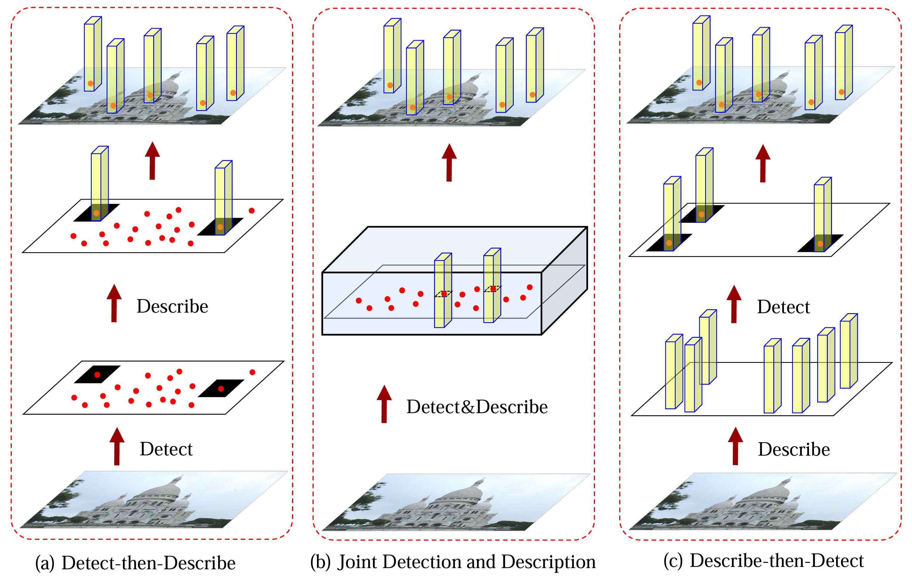
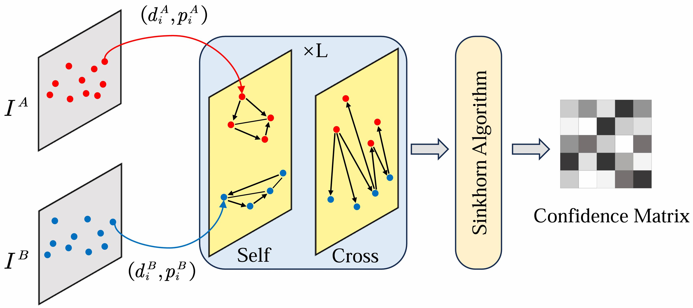

# Awesome-Local-Feature-Matching

This is the official repository for the Information Fusion 2024 paper "[Local feature matching using deep learning: A survey](https://www.sciencedirect.com/science/article/pii/S1566253524001222)".

## Abstract

Local feature matching enjoys wide-ranging applications in the realm of computer vision, encompassing domains such as image retrieval, 3D reconstruction, and object recognition. However, challenges persist in improving the accuracy and robustness of matching due to factors like viewpoint and lighting variations. In recent years, the introduction of deep learning models has sparked widespread exploration into local feature matching techniques. The objective of this endeavor is to furnish a comprehensive overview of local feature matching methods. These methods are categorized into two key segments based on the presence of detectors. The Detector-based category encompasses models inclusive of Detect-then-Describe, Joint Detection and Description, Describe-then-Detect, as well as Graph Based techniques. In contrast, the Detector-free category comprises CNN Based, Transformer Based, and Patch Based methods. 
Our study extends beyond methodological analysis, incorporating evaluations of prevalent datasets and metrics to facilitate a quantitative comparison of state-of-the-art techniques. The paper also explores the practical application of local feature matching in diverse domains such as Structure from Motion, Remote Sensing Image Registration, and Medical Image Registration, underscoring its versatility and significance across various fields. 
Ultimately, we endeavor to outline the current challenges faced in this domain and furnish future research directions, thereby serving as a reference for researchers involved in local feature matching and its interconnected domains.
A comprehensive list of studies in this survey is available at [https://github.com/vignywang/Awesome-Local-Feature-Matching](https://github.com/vignywang/Awesome-Local-Feature-Matching).

## News

😊 This project is under development. You can hit the **STAR** and **WATCH** to follow the updates.

* **2024/03/03**: Our Awesome-Local-Feature-Matching reasoning paper: [Local feature matching using deep learning: A survey](https://www.sciencedirect.com/science/article/pii/S1566253524001222) has been accepted by Information Fusion 2024.

## Table of Contents

- [Awesome-Local-Feature-Matching](#Awesome-Local-Feature-Matching)
  - [Abstract](#abstract)
  - [News](#news)
  - [Table of Contents](#table-of-contents)
  - [Related Surveys](#related-surveys)
  - [Detector-based Models](#Detector-based-Models)
    - [Detect-then-Describe](#Detect-then-Describe)
    - [Joint Detection and Description](#Joint-Detection-and-Description)
    - [Describe-then-Detect](#Describe-then-Detect)
    - [Graph Based](#Graph-Based)
  - [Detector-free Models](#Detector-free-Models)
    - [CNN Based](#CNN-Based)
    - [Transformer Based](#Transformer-Based)
    - [Patch Based](#Patch-Based)
  - [Applications](#applications)
    - [Structure from Motion](#Structure-from-Motion)
    - [Remote Sensing Image registration](#Remote-Sensing-Image-registration)
    - [Medical Image Registration](#Medical-Image-Registration)
  - [Acknowledgement](#acknowledgement)

## Related Surveys

* Advances and Challenges in Multimodal Remote Sensing Image Registration (IEEE, 2023) [[paper]](https://ieeexplore.ieee.org/abstract/document/10044278)
* A survey on deep learning in medical image registration: new technologies, uncertainty, evaluation metrics, and beyond (Arxiv, 2023) [[paper]](https://arxiv.org/abs/2307.15615)
* Image Feature Information Extraction for Interest Point Detection: A Comprehensive Review (IEEE, 2022) [[paper]](https://ieeexplore.ieee.org/abstract/document/9866553)
* Challenges in Image Matching for Cultural Heritage: An Overview and Perspective (ICIAP, 2022) [[paper]](https://link.springer.com/chapter/10.1007/978-3-031-13321-3_19)
* A review of multimodal image matching: Methods and applications (Information Fusion, 2021) [[paper]](https://www.sciencedirect.com/science/article/pii/S156625352100035X)
* Image Matching from Handcrafted to Deep Features: A Survey (IJCV, 2021) [[paper]](https://link.springer.com/article/10.1007/s11263-020-01359-2)
* Recent advances in local feature detector and descriptor: a literature survey (IJMIR, 2020) [[paper]](https://link.springer.com/article/10.1007/s13735-020-00200-3)
* Local feature descriptor for image matching: A survey (IEEE, 2018) [[paper]](https://ieeexplore.ieee.org/abstract/document/8584423/)

## Detector-based Models

  

  Fig.1: The comparison of various prominent Detector-based pipelines for trainable local feature matching is presented. Here, the categorization is based on the relationship between the detection and description steps: (a) Detect-then-Describe framework, (b) Joint Detection and Description framework, and (c) Describe-then-Detect framework.

### Detect-then-Describe

* Zippypoint: Fast interest point detection, description, and matching through mixed precision discretization (CVPR, 2023) [[paper]](https://openaccess.thecvf.com/content/CVPR2023W/IMW/papers/Kanakis_ZippyPoint_Fast_Interest_Point_Detection_Description_and_Matching_Through_Mixed_CVPRW_2023_paper.pdf)
* Attention weighted local descriptors (IEEE, 2023) [[paper]](https://ieeexplore.ieee.org/abstract/document/10105519/)
* Mtldesc: Looking wider to describe better (AAAI, 2022) [[paper]](https://ojs.aaai.org/index.php/AAAI/article/view/20138/19897)
* Cndesc: Cross normalization for local descriptors learning (IEEE, 2022) [[paper]](https://ieeexplore.ieee.org/abstract/document/9761761/)
* Alike: Accurate and lightweight keypoint detection and descriptor extraction (IEEE, 2022) [[paper]](https://arxiv.org/pdf/2112.02906)
* Neural outlier rejection for self-supervised keypoint learning (ICLR, 2020) [[paper]](https://arxiv.org/pdf/1912.10615)
* Hynet: Learning local descriptor with hybrid similarity measure and triplet loss (NIPS, 2020) [[paper]](https://proceedings.neurips.cc/paper/2020/file/52d2752b150f9c35ccb6869cbf074e48-Paper.pdf)
* Key. net: Keypoint detection by handcrafted and learned cnn filters (ICCV, 2019) [[paper]](http://openaccess.thecvf.com/content_ICCV_2019/papers/Barroso-Laguna_Key.Net_Keypoint_Detection_by_Handcrafted_and_Learned_CNN_Filters_ICCV_2019_paper.pdf)
* Beyond cartesian representations for local descriptors (ICCV, 2019) [[paper]](https://openaccess.thecvf.com/content_ICCV_2019/papers/Ebel_Beyond_Cartesian_Representations_for_Local_Descriptors_ICCV_2019_paper.pdf)
* Sosnet: Second order similarity regularization for local descriptor learning (CVPR, 2019) [[paper]](http://openaccess.thecvf.com/content_CVPR_2019/papers/Tian_SOSNet_Second_Order_Similarity_Regularization_for_Local_Descriptor_Learning_CVPR_2019_paper.pdf)
* Geodesc: Learning local descriptors by integrating geometry constraints (ECCV, 2018) [[paper]](https://openaccess.thecvf.com/content_ECCV_2018/papers/Zixin_Luo_Learning_Local_Descriptors_ECCV_2018_paper.pdf)
* Working hard to know your neighbor’s margins: Local descriptor learning loss (NIPS, 2017) [[paper]](https://proceedings.neurips.cc/paper_files/paper/2017/file/831caa1b600f852b7844499430ecac17-Paper.pdf)
* L2-net: Deep learning of discriminative patch descriptor in euclidean space (CVPR, 2017) [[paper]](http://openaccess.thecvf.com/content_cvpr_2017/papers/Tian_L2-Net_Deep_Learning_CVPR_2017_paper.pdf)
* Learning to assign orientations to feature points (CVPR, 2016) [[paper]](https://openaccess.thecvf.com/content_cvpr_2016/papers/Yi_Learning_to_Assign_CVPR_2016_paper.pdf)

### Joint Detection and Description

* Sfd2: Semantic-guided feature detection and description (CVPR, 2023) [[paper]](https://openaccess.thecvf.com/content/CVPR2023/papers/Xue_SFD2_Semantic-Guided_Feature_Detection_and_Description_CVPR_2023_paper.pdf)
* Learning semantic-aware local features for long term visual localization (IEEE, 2022) [[paper]](https://ieeexplore.ieee.org/abstract/document/9829199/)
* Learning of low-level feature keypoints for accurate and robust detection (WACV, 2021) [[paper]](https://openaccess.thecvf.com/content/WACV2021/papers/Suwanwimolkul_Learning_of_Low-Level_Feature_Keypoints_for_Accurate_and_Robust_Detection_WACV_2021_paper.pdf)
* Aslfeat: Learning local features of accurate shape and localization (CVPR, 2020) [[paper]](http://openaccess.thecvf.com/content_CVPR_2020/papers/Luo_ASLFeat_Learning_Local_Features_of_Accurate_Shape_and_Localization_CVPR_2020_paper.pdf)
* Mlifeat: Multi-level information fusion based deep local features (ACCV, 2020) [[paper]](http://openaccess.thecvf.com/content/ACCV2020/papers/Zhang_MLIFeat_Multi-level_information_fusion_based_deep_local_features_ACCV_2020_paper.pdf)
* Hdd-net: Hybrid detector descriptor with mutual interactive learning (ACCV, 2020) [[paper]](http://openaccess.thecvf.com/content/ACCV2020/papers/Barroso-Laguna_HDD-Net_Hybrid_Detector_Descriptor_with_Mutual_Interactive_Learning_ACCV_2020_paper.pdf)
* Reinforced feature points: Optimizing feature detection and description for a high-level task (CVPR, 2020) [[paper]](https://openaccess.thecvf.com/content_CVPR_2020/papers/Bhowmik_Reinforced_Feature_Points_Optimizing_Feature_Detection_and_Description_for_a_CVPR_2020_paper.pdf)
* Rfnet: An end-to-end image matching network based on receptive field (CVPR, 2019) [[paper]](https://openaccess.thecvf.com/content_CVPR_2019/papers/Shen_RF-Net_An_End-To-End_Image_Matching_Network_Based_on_Receptive_Field_CVPR_2019_paper.pdf)
* Lf-net: Learning local features from images (NIPS, 2018) [[paper]](https://proceedings.neurips.cc/paper_files/paper/2018/file/f5496252609c43eb8a3d147ab9b9c006-Paper.pdf)

### Describe-then-Detect

* Shared coupling-bridge for weakly supervised local feature learning (Arxiv, 2022) [[paper]](https://arxiv.org/pdf/2212.07047)
* Redfeat: Recoupling detection and description for multimodal feature learning (IEEE, 2022) [[paper]](https://arxiv.org/pdf/2205.07439)
* Decoupling makes weakly supervised local feature better (CVPR, 2022) [[paper]](http://openaccess.thecvf.com/content/CVPR2022/papers/Li_Decoupling_Makes_Weakly_Supervised_Local_Feature_Better_CVPR_2022_paper.pdf)
* D2d: Keypoint extraction with describe to detect approach (ACCV, 2020) [[paper]](http://openaccess.thecvf.com/content/ACCV2020/papers/Tian_D2D_Keypoint_Extraction_with_Describe_to_Detect_Approach_ACCV_2020_paper.pdf)

### Graph Based

  

  Fig.2: General GNN Matching Model Architecture. Firstly, keypoint positions pi along with their visual descriptors di are mapped into individual vectors. Subsequently, self-attention layers and cross-attention layers are thereafter applied alternately, L times, within a graph neural network to create enhanced matching descriptors. Finally, the Sinkhorn Algorithm is utilized to determine the optimal partial assignment.

* Gluestick: Robust image matching by sticking points and lines together (ICCV, 2023) [[paper]](https://openaccess.thecvf.com/content/ICCV2023/papers/Pautrat_GlueStick_Robust_Image_Matching_by_Sticking_Points_and_Lines_Together_ICCV_2023_paper.pdf)
* Learning feature matching via matchable keypoint-assisted graph neural network (Arxiv, 2023) [[paper]](https://arxiv.org/pdf/2307.01447)
* Lightglue: Local feature matching at light speed (ICCV, 2023) [[paper]](https://arxiv.org/abs/2306.13643)
* Htmatch: An efficient hybrid transformer based graph neural network for local feature matching (Signal Processing, 2023) [[paper]](https://www.sciencedirect.com/science/article/pii/S016516842200398X)
* Paraformer: Parallel attention transformer for efficient feature matching (Arxiv, 2023) [[paper]](https://arxiv.org/pdf/2303.00941)
* Resmatch: Residual attention learning for local feature matching (Arxiv, 2023) [[paper]](https://arxiv.org/pdf/2307.05180)
* Densegap: graph-structured dense correspondence learning with anchor points (ICPR, 2022) [[paper]](https://arxiv.org/pdf/2112.06910)

## Detector-free Models

## Acknowledgement

This work is supported by Beijing Natural Science Foundation No. JQ23014, in part by the National Natural Science Foundation of China (No. 62271074).